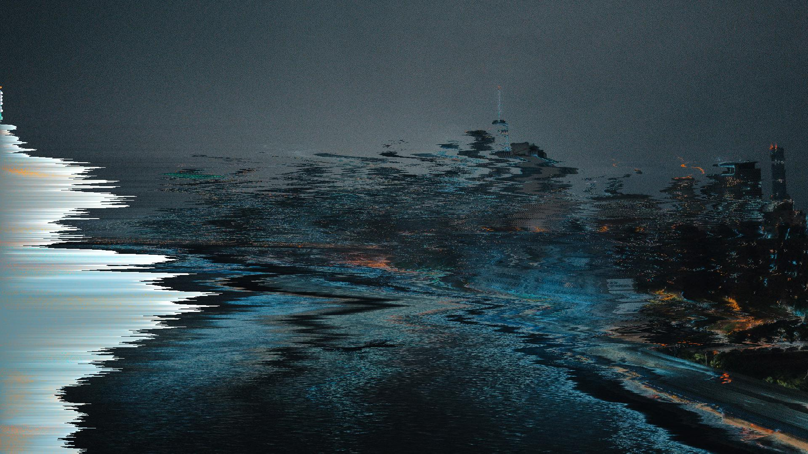
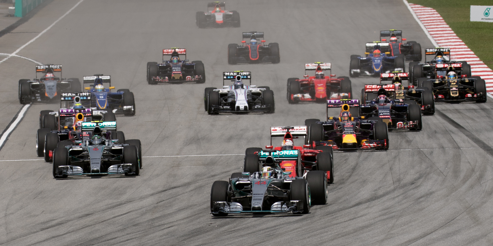
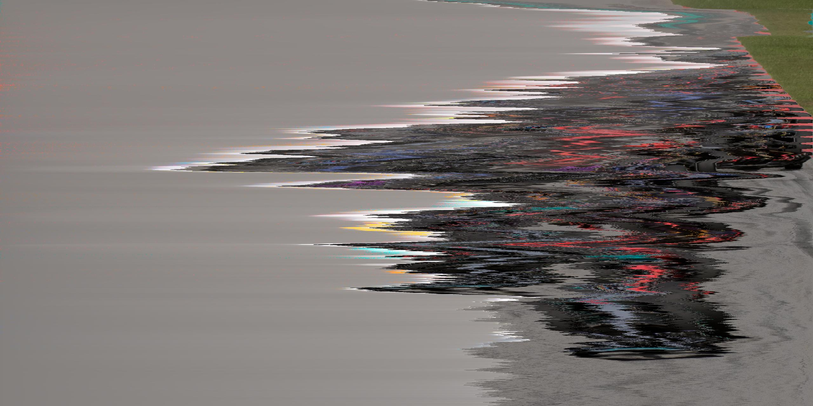
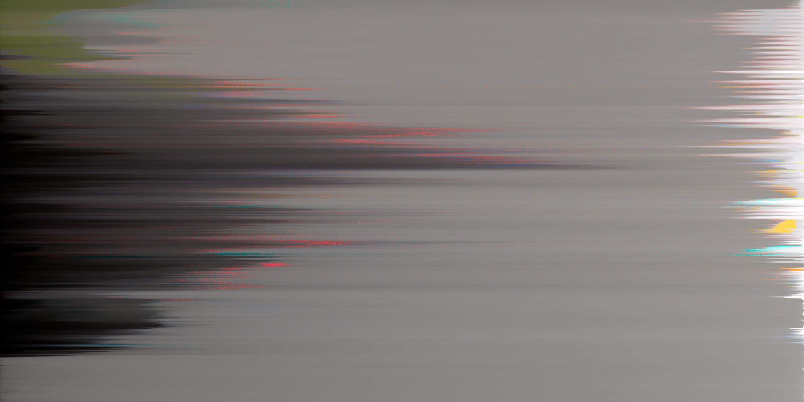
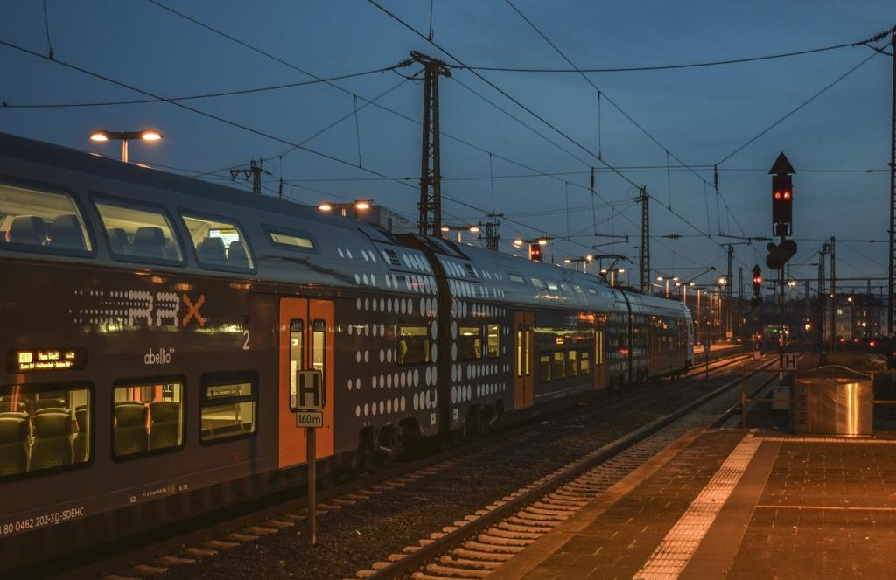
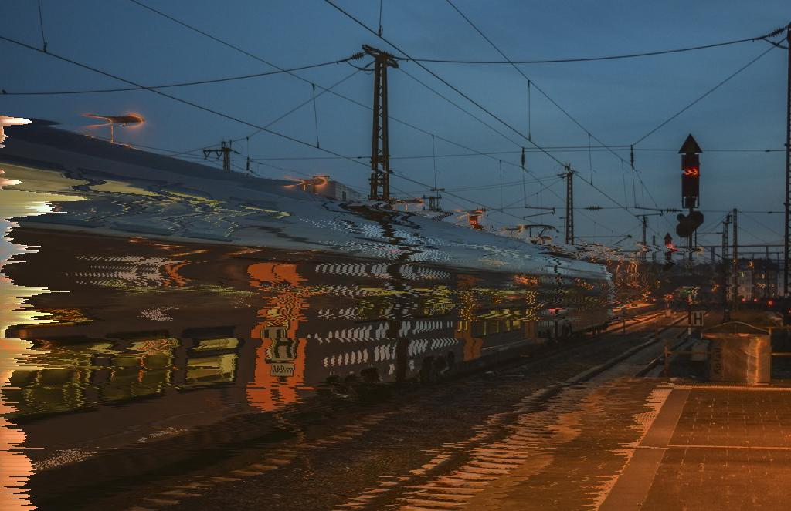

# gopxsort

Command line pixel sorter.

## Installation

Precompiled binaries for Windows and Linux can be downloaded via [releases](https://github.com/MaRcR11/gopxsort/releases). You can also download for builds on the master branch.


## Usage

```text
USAGE:
        gopxsort [FLAGS] [OPTIONS] --input <input> --output <output>

FLAGS:
        -h, --help                      Prints help information

OPTIONS:
        -i, --input <input>             Sets the input file 
        -o, --output <output>           Sets the output file
        -t, --threshold <threshold>     Sets threshold of sorting  [default: 0] [possbile values: 0-255]
```

## Examples

Commands

```bash
gopxsort -i img/city/city.jpg -o img/city/city_sorted.jpg

gopxsort -i img/city/city.jpg -o img/city/city_sorted.jpg -t 128
```

Original                    | Sorted (-t 128)                  |  Sorted                           |
--------------------------- | -------------------------------- | -------------------------------- |
 |  |  |


Original                        | Sorted (-t 128)                                | Sorted                               |
------------------------------- | ------------------------------------ | ------------------------------------ |
 |  |  |

Original                        | Sorted (-t 128)                              | Sorted                               |
------------------------------- | ------------------------------------ | ------------------------------------ |
 |  |  |
